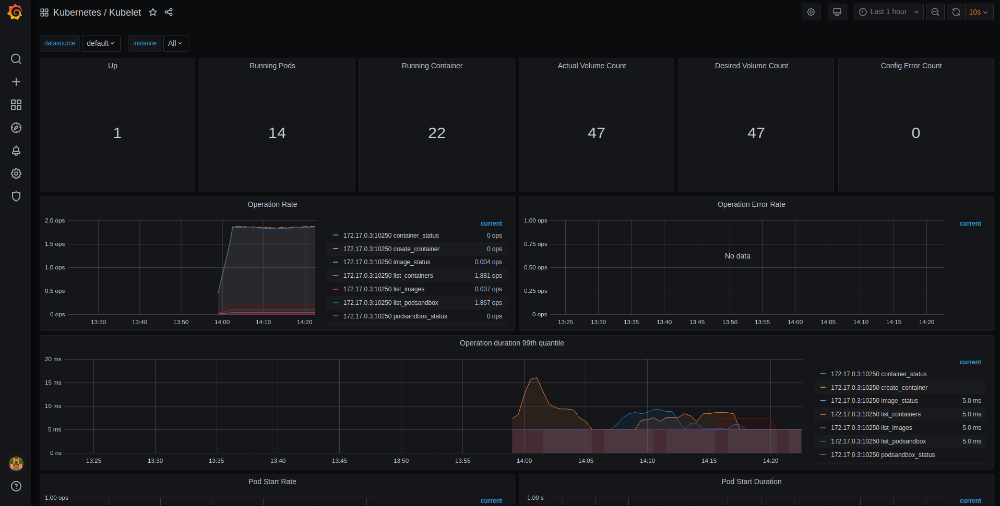

# Metrics
Apate automatically starts up a prometheus stack to provide monitoring capabilities.

## Accessing Grafana
The Grafana web interface can be found in the `apate-prometheus` namespace by default. You need to port forward the grafana pod, it will be called something like: `prometheus-operator-grafana-xxx`. So port forwarding is done like this:

```sh
kubectl port-forward prometheus-operator-grafana-xxx 3000:3000
```

You can login to Grafana with the user `admin` and password `prom-operator`.

After you have logged in you can view the various included dashboards under dashboards.

If everything went succesful the kubelet dashboard should look something like this:

